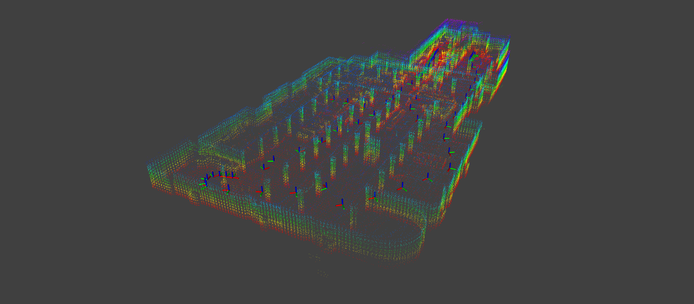

# Direct LiDAR Odometry: Fast Localization with Dense Point Clouds

This repository is for an easy-to-use library utilizing Docker.
We use the following environment.

-   docker
    -   Ubuntu 20.04
    -   ROS noetic

You can find the original instruction file [here](/INSTRUCTION.md)

We have modified `README.md` to include instructions for installing Docker images and containers.

## 1. Build docker image with Dockerfile

Using the image file, you can create a container.

```bash
cd docker
docker build -t dlo-noetic:latest .
```

## 2. Make container

Using image file, you can make container.

```bash
docker run --privileged -it \
           --volume=${DLO_root}:/root/workspace/src \
           --volume=/tmp/.X11-unix:/tmp/.X11-unix:rw \
           --net=host \
           --ipc=host \
           --name=${docker container name} \
           --env="DISPLAY=$DISPLAY" \
           ${docker image} /bin/bash
```

You need to replace `${DLO_root}`, `${docker container name}`, and `${docker image}` with your specific values. An example is provided below.

Example

```bash
docker run --privileged -it \
           --volume=/home/jin/Documents/direct_lidar_odometry:/root/workspace/src \
           --volume=/tmp/.X11-unix:/tmp/.X11-unix:rw \
           --net=host \
           --ipc=host \
           --name=dlo-noetic \
           --env="DISPLAY=$DISPLAY" \
           dlo-noetic:latest /bin/bash
```

Output

```bash
==============Direct Lidar Odometry Noetic Docker Env Ready================
root@jin-940XFG:~/workspace#
```

## 3. Build project

> ❗️ All processes are operated within the container terminal!

```bash
source /ros_entrypoint.sh
source /opt/ros/noetic/setup.bash
catkin init
catkin build
```

## 4. Execution

> ❗️ All processes are operated within the container terminal!

```bash
roslaunch direct_lidar_odometry dlo.launch \
  pointcloud_topic:=${lidar_topic} \
  imu_topic:=${imu_topic}
```

### Services

You can save .pcd and trajectory files.

Save .pcd file

```bash
rosservice call /robot/dlo_map/save_pcd LEAF_SIZE SAVE_PATH
```

Save the trajectory in the KITTI format.

```bash
rosservice call /robot/dlo_odom/save_traj SAVE_PATH
```

## Test Data

For your convenience, we provide sample test data [here](https://ucla.box.com/shared/static/ziojd3auzp0zzcgwb1ucau9anh69xwv9.bag) (9 minutes, ~4.2GB).

```bash
roslaunch direct_lidar_odometry dlo.launch
```

```bash
rosbag play dlo_test.bag
```

### Result

Video

[](https://youtu.be/fEiYgXSPHMs)

| Top view                              | Side view                             |
| ------------------------------------- | ------------------------------------- |
|  |  |


## Acknowledge

We thank the authors of the [**direct lidar odometry**](https://github.com/vectr-ucla/direct_lidar_odometry) open-source packages.

## Maintainer

-   mqjinwon@gmail.com
